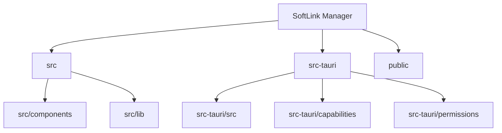

# SoftLink Manager

> 生成时间：2026-04-13T17:17:05+08:00

## 概述

SoftLink Manager 是一个 Windows 软链接管理桌面工具。前端使用 React + TypeScript 提供界面，后端使用 Tauri + Rust 执行本地文件与链接操作，并通过受限命令暴露给前端。

## 技术栈

- 语言：TypeScript、Rust
- 框架：React 19、Tauri 2
- 构建：Vite 8、TypeScript 6、Cargo

## 项目结构



## 模块索引

| 模块 | 路径 | 职责 |
|------|------|------|
| 前端入口 | `src` | React 桌面界面入口，负责页面状态、表单交互和结果展示 |
| UI 组件 | `src/components` | 创建链接、列表展示、设置面板等页面组件 |
| 前端桥接 | `src/lib` | 封装 Tauri `invoke` 调用、类型定义和错误转换 |
| Tauri 后端 | `src-tauri/src` | 注册命令、管理状态文件、执行软链接创建/删除和目录打开 |
| 能力配置 | `src-tauri/capabilities` | 将窗口绑定到允许的权限集合 |
| 权限配置 | `src-tauri/permissions` | 声明前端可调用的 Tauri commands |
| 静态资源 | `public` | 存放应用图标和静态资源 |

## 入口文件

- `src/main.tsx` - 前端挂载入口，渲染 `App`
- `src/App.tsx` - 主界面与交互调度中心
- `src-tauri/src/main.rs` - 桌面应用原生入口
- `src-tauri/src/lib.rs` - Tauri Builder、插件和命令注册入口

## 关键实现

| 文件 | 作用 |
|------|------|
| `src/lib/api.ts` | 检查 Tauri 运行环境并统一封装前端到 Rust 的命令调用 |
| `src-tauri/src/commands.rs` | 定义 `get_app_state`、`update_settings`、`create_link_job` 等命令 |
| `src-tauri/src/link_service.rs` | 执行路径校验、移动源文件、创建链接与回滚 |
| `src-tauri/src/state_store.rs` | 读写本地 `state.json`，保存设置与受管链接记录 |
| `src-tauri/capabilities/default.json` | 将主窗口绑定到默认 capability |
| `src-tauri/permissions/softlink-manager.toml` | 限定前端可调用的命令集合 |

## 安全边界

- 主窗口 capability：`src-tauri/capabilities/default.json`
- 当前允许前端调用的命令：`get_app_state`、`update_settings`、`create_link_job`、`delete_link_job`、`refresh_link_status`、`open_in_explorer`
- 浏览器模式下前端会主动阻止 Tauri 调用，需使用 `npm run tauri dev` 运行完整桌面应用

## 快速命令

```bash
npm install
npm run dev
npm run tauri dev
npm run build
npm run tauri build
npm run lint
```

## 运行说明

- `npm run dev`：仅启动前端预览，不能调用 Tauri `invoke`
- `npm run tauri dev`：启动完整桌面应用
- `npm run build`：构建前端产物到 `dist/`
- `npm run tauri build`：构建桌面应用


## MCP 工具使用优先级

- **语义搜索 / 不确定位置 / 需要理解上下文**：优先用 `ace-tool`
- **已知类、方法、符号**：优先用 `Serena`
- **IDE 原生能力**：优先用 `idea`
- **已知文件或精确关键词**：直接用 `Read` / `Grep` / `Glob` / `Edit`
